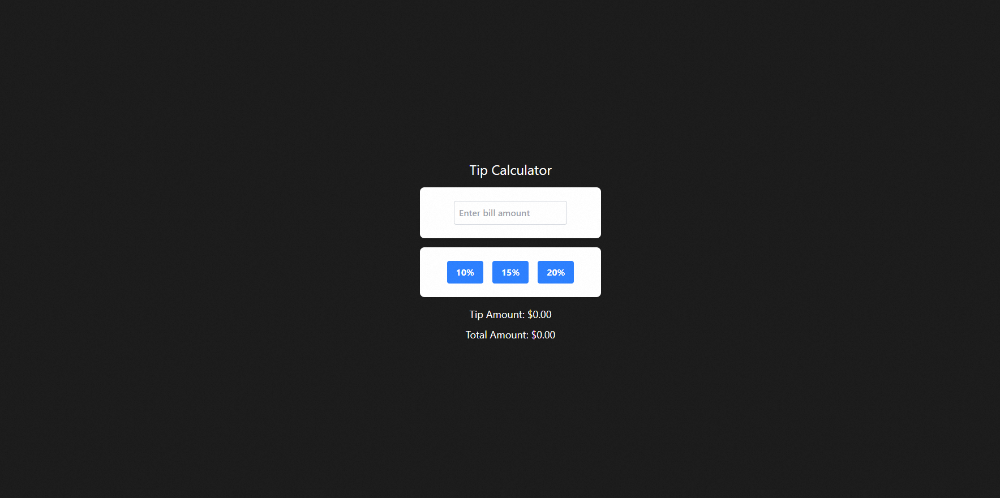

# Tip Calculator

A simple, beginner-friendly tip calculator built with React + Tailwind CSS.

🔗 **Live demo:** https://tip-calculator-react-cyan.vercel.app/



## Features

- Enter a bill amount
- Pick a tip percentage (10% / 15% / 20%) with the active choice highlighted
- See tip amount and total calculated instantly, no page reload

## Tech stack

- [React](https://react.dev/) (Vite)
- [Tailwind CSS](https://tailwindcss.com/) v4
- [Biome](https://biomejs.dev/) for linting and formatting
- Deployed on [Vercel](https://vercel.com/)

## Running locally

```bash
git clone <your-repo-url>
cd react_tip_calculator
npm install
npm run dev
```

Then open the local URL Vite prints in the terminal.

## Build

```bash
npm run build
```

Outputs a production build to `dist/`.

## Lint / format

```bash
npm run lint      # check
npm run format    # fix + format
```

## What I learned building this

- `useState` for controlled inputs and derived values (calculating tip/total from state on every render, no extra state needed)
- Conditional Tailwind classes for active/selected button styling
- Rendering a list with `.map()` instead of repeating JSX
- Setting up a Vite + React + Tailwind v4 project from scratch
- Deploying a static frontend via GitHub → Vercel with auto-deploy on push